# Projet 10 : Deploiement de la Plateforme Web : Pur_Beurre


## Choix technologiques et étapes d'installation
* Création d'une Virtual Machnine (lxc) sur un Serveur Virtuel Privé.
* Installation d'Ubuntu 18.04 sur la VM.
* Configuration un utilisateur différent de root avec droit sudo: aurelia avec mot de pass, de manière à ce que toutes actions importantes d'administrations de ce système soient faites volontairement.
* Modification du fichier sshd.config pour suspendre root de la connexion à la VM.
* Mise à jour des paquets , installation de python postgres...
* Création du dépot git dans /home/aurelia/pur_beurre/
* Création de l'environnement virtuel
* Rappatriement des données de l'application ```git pull https://github.com/horlas/OC_Project11```Installation de l'environnement : ```pip install -r requirements.txt```
* Création de base de données : ```$sudo -u postgres createdb quality``` . Création de l'utilisateur ```$sudo -u postgres createuser --interactive``` ....
* Installation des la base de données : deux dumps: table utilisateur dans quality/dumps/user.json et données dans quality.json. ```(venv)$python manage.py loaddata *fichier*```
* Ajout des variables d’environnement ( DJANGO\_SETTINGS\_MODULE, SECRET_KEY) au chargement de la session utilisateur aurelia: ajout dans /home/aurelia/.bashrc des deux lignes suivantes:

	export SECRET_KEY="XXXXX"
	
	export DJANGO\_SETTINGS\_MODULE=pur-beurre.prod_settings

### Separation d'environnement et configuration de Production 
Une fois le fichier prod\_settings.py rapatrié , on l'enlève du dépôt local en l’ajoutant dans le .gitignore 

	$git rm --cached prod_settings .gitignore 

pour la prise en considération de la desindextion de prod_settings.py

	$git add .gitignore
puis:

	$git push origin master
sur le serveur:	

	git pull <depot>
Le fichier prod_settings.py est à présent uniquement présent sur le serveur mais plus sur github.


## Installation du serveur web : nginx

	sudo apt-get install nginx

La configuration se trouve dans ```etc/nginx/sites-available/```
Création d'un fichier de configuration ```touch etc/nginx/sites-available/pur_beurre```
Edition et ecriture avec vim ```sudo vi etc/nginx/sites-available/pur_beurre```

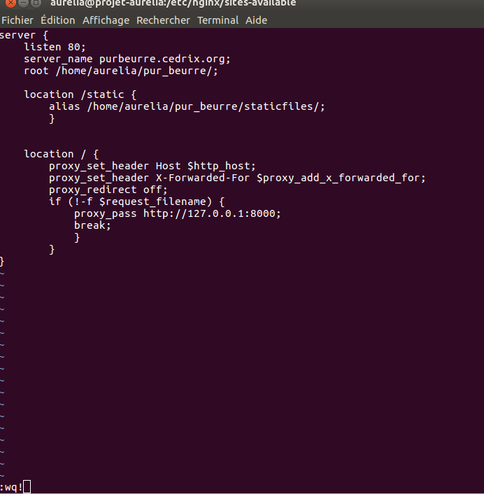

Dans ce fichier de configuration les 'directives' sont:

* listen : écouter le trafic sur le port 80
* server_name : notre nom de domaine
* root : l'endroit où se trouve l'application sur le serveur
* location /static : où se trouvent les fichiers statiques
* location / : redirige les URL vers 127.0.0.1:8000
* proxy_set_header reecrit les headers de la requête HTTP.
* X-Forwarded-For transmet l'adresse IP du client.
	
Création du lien vers ```etc/nginx/sites_enabled```

	aurelia@projet-aurelia:/etc/nginx$ ln sites-available/pur_beurre sites-enabled/

Nous rechargeons la configuration du serveur

	$sudo service nginx reload

## Installation de supervisor

Supervisor est un système qui permet de contrôler des processus dans un environnement Linux. Ici nous l'utilisons pour contrôler et redémarrer au besoin Gunicorn (serveur HTTP Python qui utilise les spécifications WSGI, utilisé par Django).

	sudo apt-get install supervisor
Ajout d'un nouveau processus dans la configuration de supervisor

	$cd etc/supervisor/conf.d/
	
	/etc/supervisor/conf.d$ sudo vi pur_beurre-gunicorn.conf

Voici la configuration mise en place 

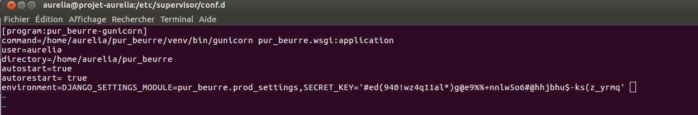

A noter que nous pouvons transmettre via supervisor des variables environnement , nous les avons donc supprimer de notre .bashrc . (SECRET_KEY, DJANGO_SETTINGS_MODULE)

La commande ```supervisorctl``` offre plein de [possibilités](http://supervisord.org/running.html#supervisorctl-actions)
Elle s'execute avec les droits ```sudo```

Ici nous disons à supervisor de prendre en considération les changements de configuration et d'ajouter le processus.

	$sudo supervisorctl reread
	pur-beurre-gunicorn: available
	$sudo supervisorctl update
	pur-beurre-gunicorn: added process group

Affiche le statut

	$sudo supervisorctl status
	pur_beurre-gunicorn              RUNNING   pid 126, uptime 15:27:20

Redémarre le processus

	$sudo supervisorctl restart pur_beurre-gunicorn
	pur_beurre-gunicorn: stopped
	pur_beurre-gunicorn: started

## Installation de Travis
Travis est un service d'automatisation. Travis crée un environnement équivalent à celui de notre application et y fait tourner les tests.
Nous l'interfaçons avec notre dépôt Github. Il surveille dans notre cas la branche ```staging``` où désormais toutes les modifications de l'application seront faites. A chaque ```git push origin staging``` , Travis lance l'environnement et fait tourner les tests. Si tout se déroule bien, nous pourrons faire un merge sur la branche  master. Nous appelons ça de l'intégration continue.

### Configuration de Travis
Création d'un [compte.](https://travis-ci.com/horlas/OC_Project11/builds)
Ajout sur la dashboard de Travis de notre dépôt Github:

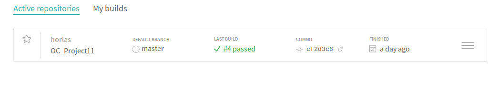

Sur notre environnement local , au même niveau que manage.py , nous créons un nouveau fichier travis.yml


#### Attention :
Nous sommes avec la version de Django 2.1.3 qui fonctionne uniquement avec une version de Postgres supérieur à 9.4 , or [Travis par défaut utilise une version de Postgres 9.2 ](https://docs.travis-ci.com/user/database-setup/#postgresql). C'est pour cela nous avons rajouté les lignes suivantes:

	addons:
		postgres: '9.5'
Pour 'forcer' la version de Postgresql.

#### Une vision de l'historique de notre activité:

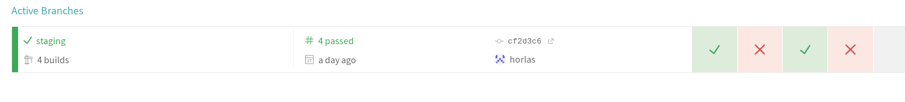
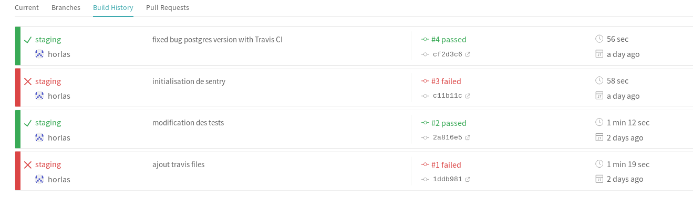
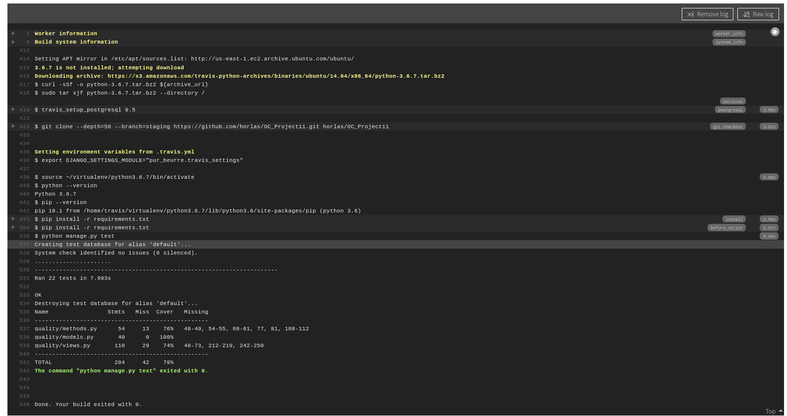

## Monitorer le serveur : mise en place de Newrelic
[Newrelic Infrastructure](https://infrastructure.eu.newrelic.com) offre la possibilité de monitorer notre serveur : Etat de la CPU , de la mémoire vive, le load average etc....

* Création d'un compte sur New Relic
* Sur le site Infrastructure/All Host/Add host

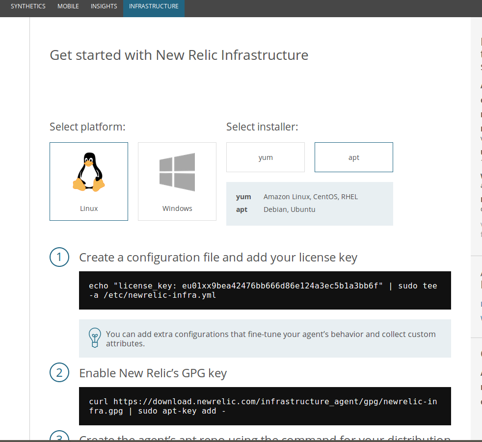

Suivre les instructions:

* Mise en place d'une clé de licence dans un fichier de configuration Newrelic
* Installation de Newrelic avec cette nouvelle lincence: de charger le dépôt d'installation de Newrelic, et installation du paquet.
* Dorénavant le monitoring de notre système peut se [surveiller](https://infrastructure.eu.newrelic.com/accounts/2173498/processes) depuis la plateforme New Relic :

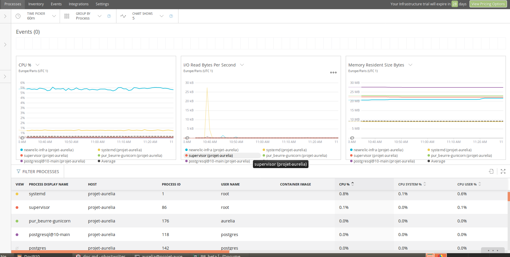

## Surveillance de l'application Django Pur_beurre : Sentry
* Création d'un compte, création d'un projet Django nommé pur-beurre.
* Suivre les instructions de configuration:

#### Attention :

Cette [documentation](https://docs.sentry.io/clients/python/integrations/django/) est dépréciée .

Nous avons suivi les instructions de [celle-ci](https://docs.sentry.io/error-reporting/quickstart/?platform=python)
Nous avons choisi de le faire sur notre environnement de développement et mettre à jour notre fichier settings.py dont le fichier prod_settings hérite. Pour ainsi bénéficier de Sentry sur tous nos environnements. (Dev, Test, Prod)

	$pip install --upgrade sentry-sdk==0.5.5

Ne pas oublier de mettre à jour requirements.tx

	$pip freeze > requirements.txt	


Dans notre cas nous avons rajouté ces quelques lignes à notre fichier de configuration settings.py

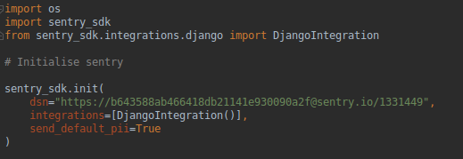

Puis mise à jour du dépôt distant et de l'application en production sur la VM. 
###### Ne pas oublier de faire un ```pip install requirements.txt``` pour installer Sentry.

Dorénavant les erreurs liées à l'application seront reportées [ici](https://sentry.io/aurelia-gourbere/pur_beurre/)


Sur la plateforme les

### Exemples d'erreurs rapportées

* Erreur générée sur l'envirronement de test Travis lorsque Postgres n'était pas dans la bonne version: [ici](https://sentry.io/aurelia-gourbere/pur_beurre/issues/780629387/)

* Erreur générée lors de l'oubli de la mise à jour des requirements.txt sur l'environnement de Production : [ici](https://sentry.io/aurelia-gourbere/pur_beurre/issues/780728172/?query=is:unresolved)

---------

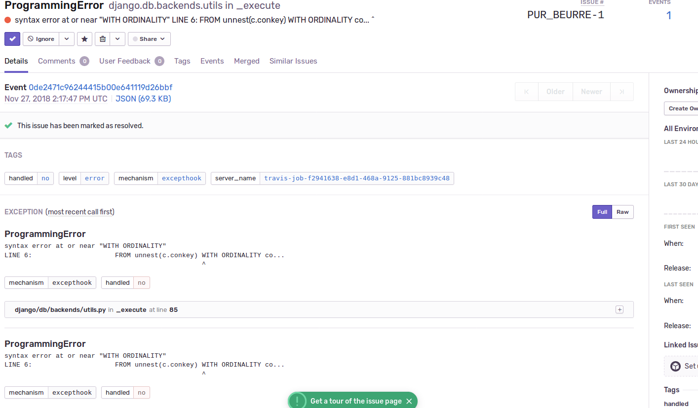


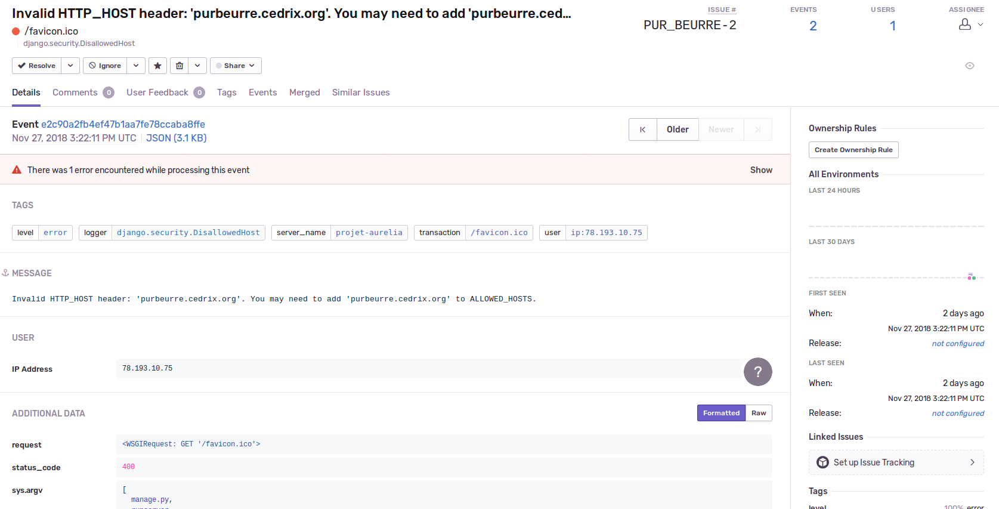